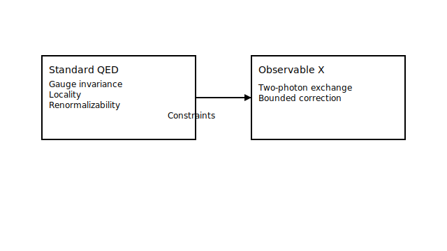

Physics Statement (Radiative Two-Photon Exchange Rigidity)

Claim
Under standard QED assumptions (gauge invariance, locality, renormalizability, and the usual analyticity and unitarity conditions for scattering amplitudes), radiative two photon exchange contributions to the target observable [OBSERVABLE X] are structurally constrained and cannot produce unbounded or parametrically uncontrolled shifts in [OBSERVABLE X] within the stated kinematic and modeling domain. Any deviation beyond [EPSILON] requires the failure of at least one assumption listed below or the presence of an omitted non QED contribution at the relevant scale.

Assumptions
A1 Gauge invariance (Ward Takahashi identities hold for the relevant amplitudes)
A2 Locality and microcausality (standard local QFT setting)
A3 Renormalizability of QED in the regime of interest (standard renormalization scheme applies)
A4 Unitarity (optical theorem consistency for the channels used)
A5 Analyticity and crossing in the stated kinematic domain (no unexpected singular structure)
A6 The hadronic or nuclear structure input used here is within its declared validity class [INPUT CLASS DESCRIPTION]

Scope diagram

The diagram indicates how standard QED constraints limit the effect of two-photon exchange on the observable within the stated domain.

What would falsify this
F1 Gauge violation signature
An explicit calculation or measurement implying a Ward identity violation large enough to account for a shift greater than [EPSILON] in [OBSERVABLE X]

F2 Nonlocal or nonanalytic anomaly in the relevant amplitude
Observation or theory evidence of an unexpected singularity, branch cut, or resonance like structure in the two photon exchange amplitude within the stated domain that is not captured by standard analytic continuation

F3 Unitarity inconsistency
A demonstrated mismatch with optical theorem constraints for the same channels and kinematics sufficient to force a correction beyond [EPSILON]

F4 Counterexample construction inside QED
An explicit within QED construction (respecting A1 A5) that produces a correction larger than [EPSILON] without introducing new scales or leaving the stated domain

F5 Structure input failure
A validated discrepancy showing the adopted structure model class A6 cannot represent the needed intermediate states or form factor behavior, and the corrected input necessarily induces a shift beyond [EPSILON]

Where the certificate fits
This repository exists to make the above claim checkable. The certificate and verifier do not replace the physics argument; they are guardrails that ensure the stated assumptions, inputs, and computations are applied consistently and reproducibly, and that the numerical or symbolic steps used to support the claim can be independently rerun and audited.

One worked implication
Implication
Given the constraints above, the uncertainty contribution from radiative two photon exchange to [UNCERTAINTY BUDGET ITEM] can be bounded by [BOUND STATEMENT], which in turn stabilizes the extracted value of [DOWNSTREAM PARAMETER] against uncontrolled radiative drift in the stated domain.

